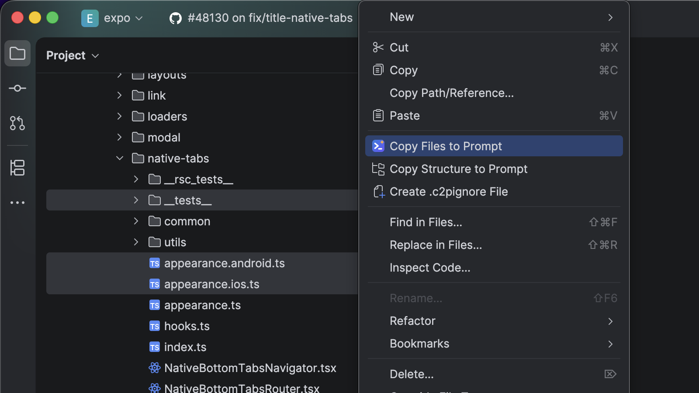
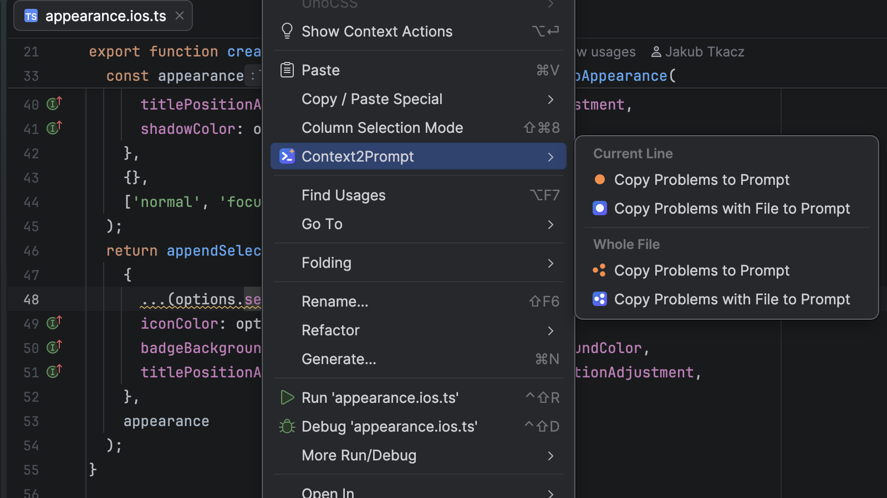
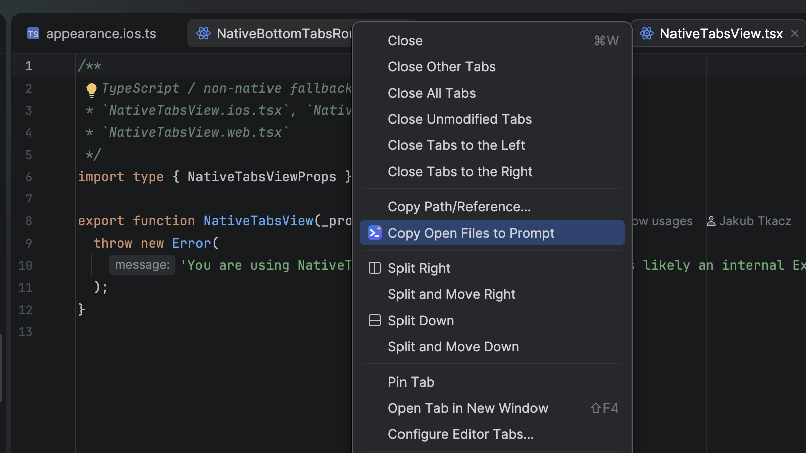

# Context2Prompt

<!-- Plugin description -->
**Context2Prompt** copies files, project structure, and code problems from your IDE as LLM-ready prompts.

Select files or folders in the Project view, open files, or a file with errors - and get a clean, XML-formatted prompt in your clipboard, ready to paste into Claude, ChatGPT, or any other assistant.

## Features

- **Copy Files to Prompt** — selected files and folders with content, formatted as XML documents with project structure
- **Copy Structure to Prompt** — compact project tree without file content
- **Copy Open Files to Prompt** — all open editor tabs in one prompt
- **Copy Problems to Prompt** — errors and warnings from the current file or current line, with or without full file content
- **`.gitignore` support** — respects your ignore rules, including nested ignore files, with a prompt to include ignored items explicitly
- **`.c2pignore`** — plugin-specific ignore rules that override `.gitignore` (add or re-include entries just for prompts)
- Skips binary and oversized files automatically
- Notification with file count and approximate token estimate
<!-- Plugin description end -->

## Screenshots





## Development

### Run sandbox
```shell
./gradlew runIde
```

### Tests
```shell
./gradlew test
```

### Compatibility check
```shell
./gradlew verifyPlugin
```

Runs Plugin Verifier against IDE builds in the `sinceBuild`..open range.
Errors (incompatible API) are blockers — bump `pluginSinceBuild` in `gradle.properties`.
Internal API warning for `DaemonCodeAnalyzerImpl` is expected, not a blocker.

### Build
```shell
./gradlew buildPlugin
```

Artifact: `build/distributions/context2prompt-<version>.zip`

## Release process

1. Keep changes in the `[Unreleased]` section of `CHANGELOG.md` during development
2. Bump `version` in `gradle.properties` (semver: fixes — patch, features — minor)
3. `./gradlew patchChangelog` — moves `[Unreleased]` into a dated version section
4. `./gradlew test verifyPlugin`
5. `./gradlew buildPlugin`
6. Upload the zip: first release via https://plugins.jetbrains.com/plugin/add,
   updates via plugin page → Versions → Upload Update
7. Commit `CHANGELOG.md` + `gradle.properties`, tag `v<version>`